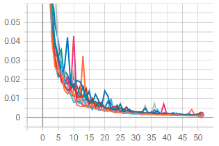
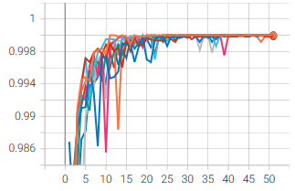
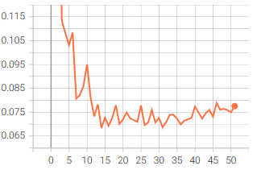
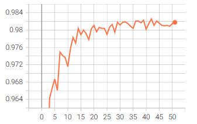
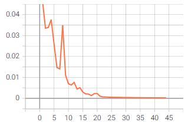
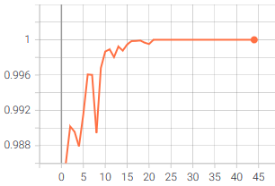
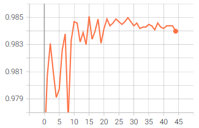

# MNIST dataset 

This folder includes a federated learning strategy with PaddleFL. In addition, in [paddlepaddle_mninst.py](/PaddleFL/MNIST/paddlepaddle_mninst.py), you can get the script that run centralizes learning on the same dataset with paddelpaddle.

### Prerequisites 

To work with the MNIST dataset, downloaded in the folder [data](/data), you must to install **mlxtend**. Use the following command:

    pip3 install mlxtend

### Run script

To start the experiment, we have to generate the **data_idx.json** file. If it is not already been done, you can go to the [data](/data) folder.

Now that the data are distributed, we can execute and stop the federated learning script with the following commands:

    # Run the FL
    ./run.sh
    # Stop the FL
    ./stop.sh

To conclude, you can execute the paddlepaddle's script with this command, to compare your results:

    python3 paddlepaddle_mninst.py

> Remarks: 
> * For the federated program, you can see the test accuracy in the log of the client 0
> * To display the graph of metrics for each client and test data, you can use [parser.py](/PaddleFL/MNIST/parser.py) with the following command: 
>
>       python3 parser.py --path <directory to the log file or the log folder>
>
> That return the folder named **summary_logs**. After this you can run Tensorboard with this command:
>
>       tensorboard --logdir \<directory to summary_logs \>
>
> For example, with the CNN, I obtain this graph:
><table>
  <tr>
      <th colspan=2>CNN PaddleFL</th>
  </tr>
  <tr>
    <td>Train Loss</td>
     <td>Train Accuracy</td>
  </tr>
  <tr>
    <td></td>
    <td></td>
  </tr>
  <tr>
    <td>Test Loss</td>
     <td>Test Accuracy</td>
  </tr>
  <tr>
    <td></td>
    <td></td>
  </tr>
 </table>
 
<table>
    <tr>
        <th colspan=2>CNN PaddlePaddle</th>
    </tr>
  <tr>
    <td>Train Loss</td>
     <td>Train Accuracy</td>
  </tr>
  <tr>
    <td></td>
    <td></td>
  </tr>
  <tr>
    <td>Test Loss</td>
     <td>Test Accuracy</td>
  </tr>
  <tr>
    <td></td>
    <td></td>
  </tr>
 </table>