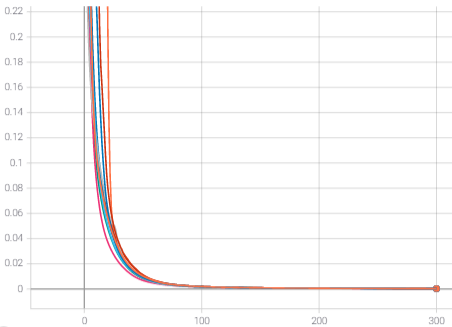
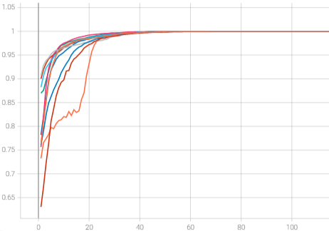
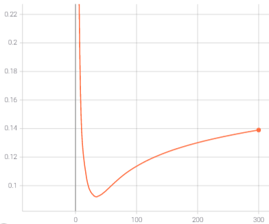
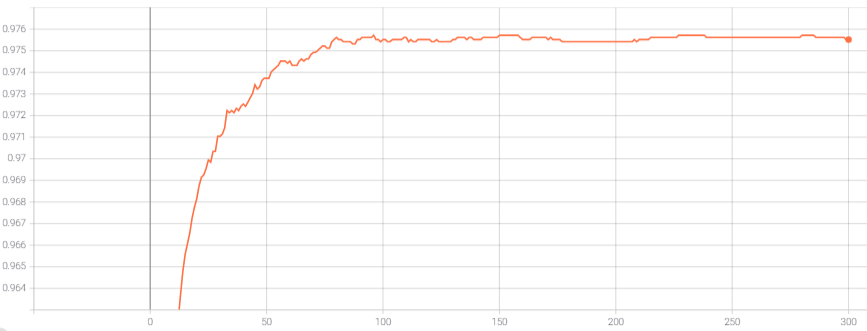
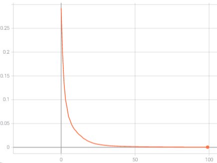
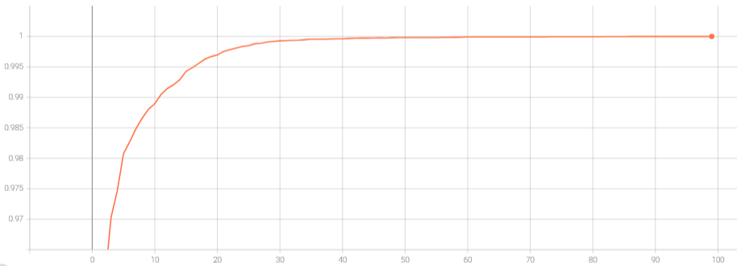
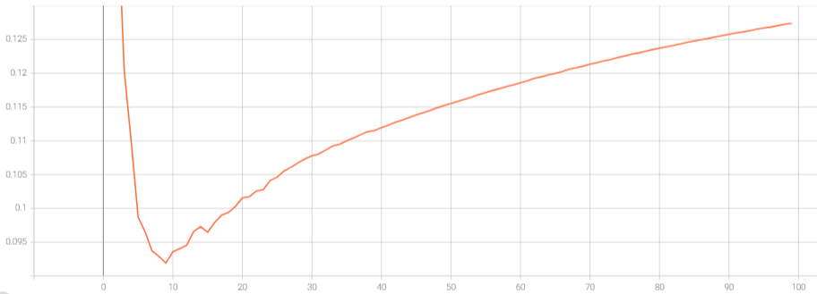
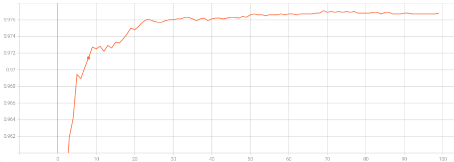

# PaddleFL of Baidu

[Paddle Federated learning](https://github.com/PaddlePaddle/PaddleFL) is developed by Baidu, a Chinese Company. Based on the framework PaddlePaddle, it offers the possibility to do Federated Learning with remote data. With the possibility to use GPU or not, it has some technical like Federated Averaging, Differential Privacy and Secure Aggregation. In this framework, Baidu offers two packages, **paddle_fl** that allows to work with horizontal partitioning of data and **mpc** that allows to work with vertical partitioning of data. These two methods are applicable in simulation or deployment mode.

### Work environment

To beginning, we will establish our work environment. It's recommended using the docker image provide by Baidu, you can see in the next part how work with it.

Its size is 17GB. If it's a problem for you, an alternative of this docker image is to install it from scratch, there takes some difficulty with dependencies. The link to the instruction of installation can be found on the documentation, at this [link](https://paddlefl.readthedocs.io/en/latest/compile_and_intall.html#compile-from-source-code).

#### Docker image

If you desire test PaddleFL to see if this framework is interesting, I recommend using the docker image and so you eliminate some problem with dependencies. When you have installed [Docker](https://www.docker.com/), the shell's command to download the docker's image of Baidu is:

    docker pull paddlepaddle/paddlefl:latest

This docker image allows you to execute all PaddleFL's script. For this, nothing could be easier, you run the docker image with the following command:

    docker run -it --rm -v <PROJECT PATH>:/My_program/ -v <DATA PATH>:/data/ paddlepaddle/paddlefl

After two folders are crated in the docker:
    * **My_program** that contains the project code. 
    * **data**, that contains the data.
To acquire more information about the use of Docker, you can observe this [tutorial](https://docs.docker.com/get-started/).

> If you use WSL2, PaddleFL has a problem of compatibility with it kernel. 
> To resolve it, in the folder of the user (for me C:\Users\ <USER_NAME>), you have to create a new file, named **.wslconfig**, who contain the following lines:
>
>       [wsl2]
>       kernelCommandLine = vsyscall=emulate

### Experiment execution

To begin the experiment, personalize the [config.json](/PaddleFL/config.json) file and install the requirement with this command:

    pip3 install -r requirement

Now that the configs are configured, perform the strategy with the following command:

    sh run.sh <PATH TO THE CONFIG FILE>

> Notes:
>   * Some examples of config file are given in the folder [configs_examples](/PaddleFL/configs_examples)
>   * To use personal data and models, a dummy file is present in [data_loader](/PaddleFL/data_loader) and [models](/PaddleFL/models) that contains the template to generate new data loader and model class.
>During the execution a result folder is created. That can be used to analyze the diverse metrics (clients and server) with Tensorboard. To display the Tensorboard interface, you can use this command:
>
>           tensorboard --logdir <PATH TO THE RESULT FOLDER\>
>
> For example, with the MP, I get this graph:
><table>
>  <tr>
>      <th colspan=2>MP PaddleFL</th>
>  </tr>
>  <tr>
>    <td>Train Loss</td>
>     <td>Train Accuracy</td>
>  </tr>
>  <tr>
>    <td></td>
>    <td></td>
>  </tr>
>  <tr>
>    <td>Test Loss</td>
>     <td>Test Accuracy</td>
>  </tr>
>  <tr>
>    <td></td>
>    <td></td>
>  </tr>
> </table>
> 
><table>
>  <tr>
>      <th colspan=2>MP PaddlePaddle</th>
>  </tr>
>  <tr>
>    <td>Train Loss</td>
>     <td>Train Accuracy</td>
>  </tr>
>  <tr>
>    <td></td>
>    <td></td>
>  </tr>
>  <tr>
>    <td>Test Loss</td>
>     <td>Test Accuracy</td>
>  </tr>
>  <tr>
>    <td></td>
>    <td></td>
>  </tr>
> </table>

### Framework analysis

Currently, PaddleFL has minor community that generates difficulty to find some help or to find examples of script. The lack of documentation in English (the majority of articles are in Chinese) makes it difficult to work with the framework.

To evaluate this framework, PaddleFL are applied on the MNIST dataset. You can follow the config file in the folder [configs_examples](/PaddleFL/configs_examples/) to run the experiment. For the experience, the strategy is composed by 10 clients that train the model locally on 3 epochs by round. The data of the client are randomly selected on all the train dataset of the MNIST, the distribution of the data, used in my study, is done in the [data](/data) folder. For the training, we will use the SGD optimizer with a learning rate of 0.1. To compare the accuracy of the model, obtains with the centralized and the federated strategies, we test the model on the test dataset of MNIST. 

Two models are proposed:
* A multilayer perceptron composed by:
    * Two fully connected layers (size: 100, activation function: ReLU)
    * A fully connected output layer (size: 10, activation function: Softmax)
* A convolutional neural network, compose by:
    * A first convolutional layer (kernel size: 3*3, sub convolution kernels: 32).
    * A first max pooling layer, (size: 2*2, step size: 1).
    * A flatten layer.
    * A first fully connected layer (size: 128, activation: None).
    * A fully connected output layer (size: 10, activation function: Softmax)

All these models are defined in the [models](/PaddleFL/models) folder.

Each model is trained until the convergence or the overfitting. If the model converge, metrics are picked at the first epoch/round of the convergence, else if it overfits  metrics are picked at the last epoch/round before the overfitting.

In the following, a summary table of all my accuracies obtains on the test's dataset.

   

As a reminder, an epoch corresponds to the reading of all the learning examples. In the case of the federated network, a global epoch is realized when each client has realized an epoch which corresponds to the number of rounds x the number of epochs per client.

**Notes:**

* With Federated Averaging, the accuracies is not impacted.
* The run time is more important when we use the federated learning. Due to the communication time between the server and the workers or the number of loops more important.
* Small model take more loops to converge, so more communication between the server and the workers that increase the run time
* Due to the parallelisation of the local training and the small increase in the number of loops, the CNN does not take much extra time during the federated training compared to the centralised training. The extra time is the communication time

This framework offers many interesting strategies of FL like Federated Averaging, Differential Privacy and Secure Aggregation and the possibility to made simulation or deployment. But we have to wait some times to detect if it's evolved, if the community increases, if more examples are developed and if an English documentation is published.