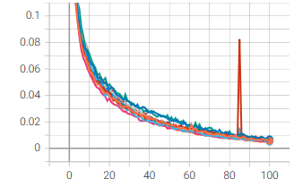
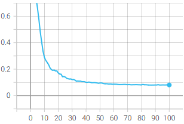
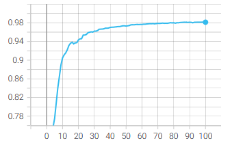
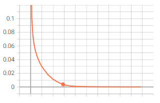
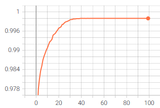
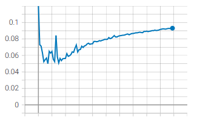
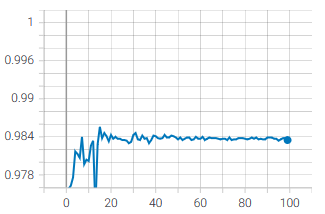

# MNIST dataset 

In this folder, we establish a federated learning strategy with Tensorflow Federated. Additionally, in[tensorflow_mninst.py](/TensorFlow_Federated/MNIST/tensorflow_mninst.py), you can find the script that run centralizes learning on the same dataset.

### Prerequisites 

To work with the MNIST dataset, downloaded in the folder [data](/data), you must to install **mlxtend**. Use the following command:

    pip3 install mlxtend

### Run script

To begin the experiment we have to generate the **data_idx.json** file. If it is not already been done, you can go to the [data](/data) folder.

Now that the data are distributed, we can perform the federated learning script with the following command:

    # Run the FL
    python tensorflow_federated_mninst.py

To conclude, you can execute the tensorflow script with this command, to compare your results:

    python tensorflow_mninst.py

### Remarks

In [keras_utils.py](/TensorFlow_Federated/MNIST/keras_utils.py) you can get the modified script of the source file keras_utils.py that allows to take the client's metrics during the training and evaluation.

More the output of these two scripts returns a log folder that can be used to analyze the diverse metrics (clients and server) with Tensorboard. To display the Tensorboard interface, you can use this command:

    tensorboard --logdir <directory to the log folder>

For example, with the CNN, I get this graph:
<table>
    <tr>
        <th colspan=2>CNN Tensorflow Federated</th>
    </tr>
  <tr>
    <td>Train Loss</td>
     <td>Train Accuracy</td>
  </tr>
  <tr>
    <td></td>
    <td></td>
  </tr>
  <tr>
    <td>Test Loss</td>
     <td>Test Accuracy</td>
  </tr>
  <tr>
    <td></td>
    <td></td>
  </tr>
 </table>
<table>
    <tr>
        <th colspan=2>CNN Tensorflow</th>
    </tr>
  <tr>
    <td>Train Loss</td>
     <td>Train Accuracy</td>
  </tr>
  <tr>
    <td></td>
    <td></td>
  </tr>
  <tr>
    <td>Test Loss</td>
     <td>Test Accuracy</td>
  </tr>
  <tr>
    <td></td>
    <td></td>
  </tr>
 </table>