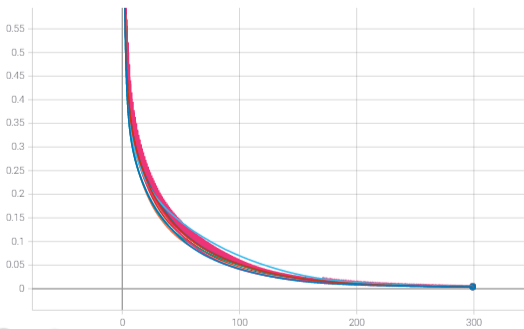
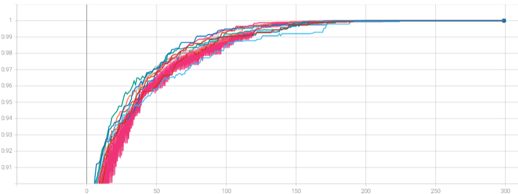
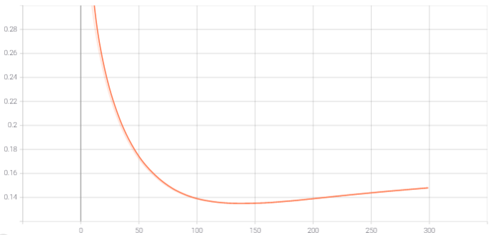
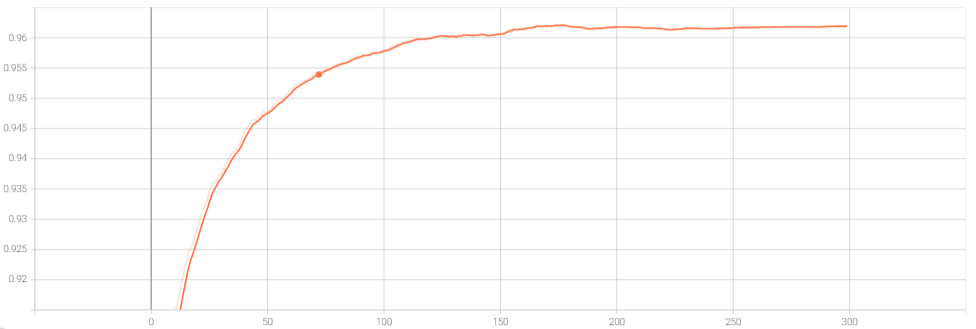
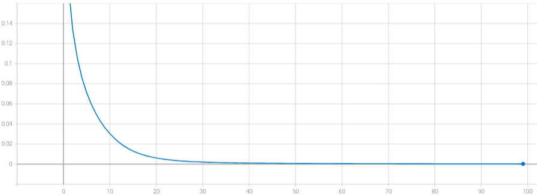
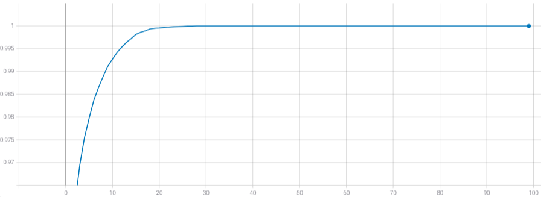
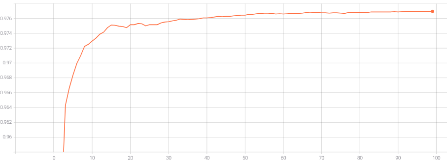
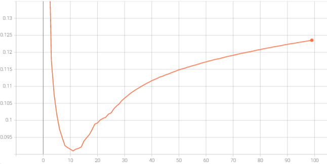

# Tensorflow Federated of Google Inc

[Tensorflow Federated](https://github.com/tensorflow/federated) is an open-source framework, developed by Google Inc. Based on the framework Tensorflow, it allows to simulate a Federated Learning strategy. Tensorflow Federated allows to developed aggregates or learning methods. It is composed by two layers:

* Federated Learning (FL) API, this layer is the high-level of the framework. It allows doing federated training and evaluation, with the tools give by the API.
* Federated Core (FC) API, this layer allows to test and devise new federated algorithms based on TensorFlow.

It doesn't offer the privacy of data and the use of GPU. But [TensorFlowPrivacy](https://github.com/tensorflow/privacy) can be adding, that allow to train machine-learning models with data privacy.

### Work environment

We will establish our work environment. With Ubuntu or MacOS, install it with this [instruction](https://www.tensorflow.org/federated/install).

Else install [Docker](https://www.docker.com/), and build the image, from the Dockerfile, with the following command:

    docker build -t project/tff <DOCKERFILE PATH>

This docker image allows to execute all TensorFlow Federated script. For this, nothing could be easier, run the docker image with the following command:

    docker run -it --rm -v <PROJECT PATH>:/My_program/ -v <DATA PATH>:/data/ project/tff /bin/bash

After two folders are crated in the docker:
    * **My_program** that contains the project code. 
    * **data**, that contains the data.
To acquire more information about the use of Docker, you can observe this [tutorial](https://docs.docker.com/get-started/).

### Experiment execution

To begin the experiment, personalize the [config.json](/TensorFlow_Federated/config.json) file. 

Now that the configs are configured, perform the strategy with the following command:

    sh run.sh <PATH TO THE CONFIG FILE>

> Notes:
>   * Some examples of config file are given in the folder [configs_examples](/TensorFlow_Federated/configs_examples)
>   * To use personal data and models, a dummy file is present in [data_loader](/TensorFlow_Federated/data_loader) and [models](/TensorFlow_Federated/models) that contains the template to generate new data loader and model class.
>During the execution a result folder is created. That can be used to analyze the diverse metrics (clients and server) with Tensorboard. To display the Tensorboard interface, you can use this command:
>
>           tensorboard --logdir <PATH TO THE RESULT FOLDER\>
>
> For example, with the MP, I get this graph:
> <table>
>     <tr>
>         <th colspan=2>MP Tensorflow Federated</th>
>     </tr>
>   <tr>
>     <td>Training Loss</td>
>      <td>Training Accuracy</td>
>   </tr>
>   <tr>
>     <td></td>
>     <td></td>
>   </tr>
>   <tr>
>     <td>Test Loss</td>
>      <td>Test Accuracy</td>
>   </tr>
>   <tr>
>     <td></td>
>     <td></td>
>   </tr>
>  </table>
> <table>
>     <tr>
>         <th colspan=2>MP Tensorflow</th>
>     </tr>
>   <tr>
>     <td>Training Loss</td>
>      <td>Training Accuracy</td>
>   </tr>
>   <tr>
>     <td></td>
>     <td></td>
>   </tr>
>   <tr>
>     <td>Test Loss</td>
>      <td>Test Accuracy</td>
>   </tr>
>   <tr>
>     <td></td>
>     <td></td>
>   </tr>
>  </table>

### Framework analysis

TensorFlow Federated has massive community that allow a fast evolution and a facility to find some help. The script is well commented which is easy the comprehension of the diverse function or also the modification of the source script. For example, the file [my_keras_model.py](/TensorFlow_Federated/federated/my_keras_model.py) contains a new instance of the class named **_KerasModel** allowing to return the client metrics during the training or evaluation.

To evaluate this framework, TensorFlow Federated are applied on the MNIST dataset. You can follow the config file in the folder [configs_examples](/TensorFlow_Federated/configs_examples/) to run the experiment. For the experience, the strategy is composed by 10 clients that train the model locally on 3 epochs by round. The data of the client are randomly selected on all the train dataset of the MNIST, the distribution of the data, used in my study, is done in the [data](/data) folder. For the training, we will use the SGD optimizer with a learning rate of 0.1. To compare the accuracy of the model, obtains with the centralized and the federated strategies, we test the model on the test dataset of MNIST. 

Two models are proposed:
* A multilayer perceptron composed by:
    * Two fully connected layers (size: 100, activation function: ReLU)
    * A fully connected output layer (size: 10, activation function: Softmax)
* A convolutional neural network, composed by:
    * A first convolutional layer (kernel size: 3*3, sub convolution kernels: 32).
    * A first max pooling layer, (size: 2*2, step size: 1).
    * A flatten layer.
    * A first fully connected layer (size: 128, activation: None).
    * A fully connected output layer (size: 10, activation function: Softmax)

All these models are defined in the [models](/TensorFlow_Federated/models) folder.

Each model is trained until the convergence or the overfitting. If the model converge, metrics are picked at the first epoch/round of the convergence, else if it overfit  metrics are picked at the last epoch/round before the overfitting.
In the following, a summary table of all my accuracies obtains from the test dataset.

   

As a reminder, an epoch corresponds to the reading of all the learning examples. In the case of the federated network, a global epoch is realized when each client has realized an epoch which corresponds to the number of rounds x the number of epochs per client.

**Notes:**

* With Federated Averaging, the accuracies is not impacted. We lost approximately 0.1 accuracy.
* The federated learning take more iterations.
* The run time is more important when we use the federated learning. Due to number of iteration more important and the locals training, with TFF, are not executing in parallel.
* Increase of times and iteration where the number of parameters is important (i.e. CNN: time is x13 more important).

We can say this framework remains a good tool to simulate some federated learning strategies because with the different examples, issues and error report finding on the internet, it's easy to use it. The principal problem of this framework that it doesn't offer deployment mode. But frequently new updates are published, we can hope to view quickly a deployment version.